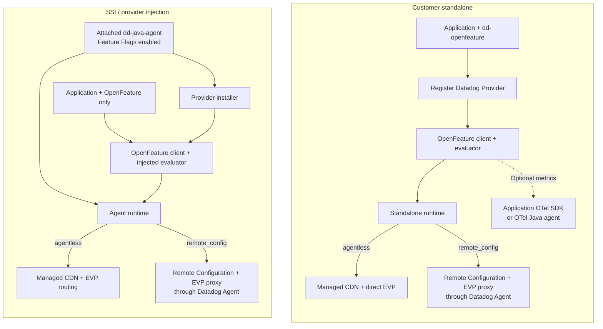
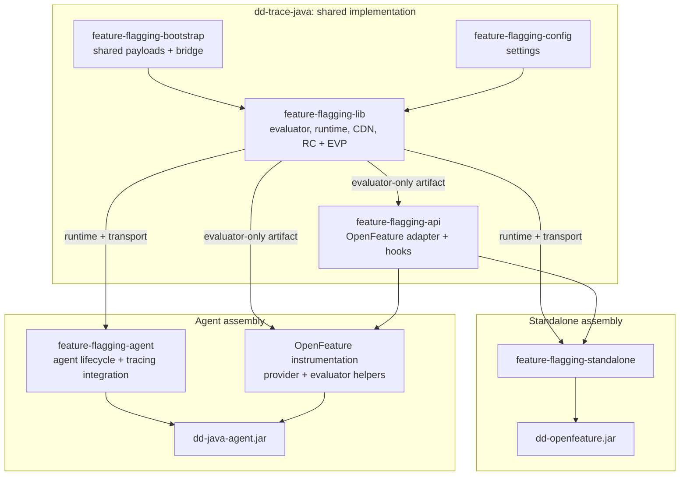

# Java Feature Flags: organize as customer-standalone and SSI

Author: Leo Romanovsky  
Updated: Sep 21, 2026
Status: integrated POC for Java Language Tools discussion; not a release candidate.

## Motivation and proposal

Customers must be able to adopt Feature Flags without changing their instrumentation choice. Some use the OTel Java agent and dual-ship telemetry. Others have no Java agent or telemetry collector.

Deliver two installation paths from one implementation in `dd-trace-java`: standalone `dd-openfeature`, and provider injection through `dd-java-agent`. Keep the existing repository, public provider API, Maven coordinates, and release process.

[Integrated Java POC #12576](https://github.com/DataDog/dd-trace-java/pull/12576) is the discussion baseline. It replaces the earlier stack as the proposed starting point. The POC combines evaluation, runtime, and HTTP code in one shared library. Both assemblies remain subject to Java-team review.

**Standalone publication must not block SSI. SSI certification must not block standalone.**

## Customer paths and entrypoints

OTel-only applications use the standalone provider.
Existing manual registration remains supported with Datadog instrumentation; compatible provider/agent pairs use the agent runtime.
Installation and configuration delivery are separate choices. Both standalone and SSI support direct CDN delivery or explicitly selected Remote Configuration.



Arrows show setup and runtime ownership, not a network call for each evaluation. Evaluations use cached configuration.
The two agent configuration paths are alternatives. The [dogfood POC #124](https://github.com/ddoghq/ffe-dogfooding/pull/124) demonstrates both installation shapes with direct delivery.

`DD_FEATURE_FLAGS_CONFIGURATION_SOURCE=agentless` selects direct configuration. It does not mean the Java agent is absent.
Standalone direct delivery requires credentials and network access to the CDN and event intake, but neither agent nor a collector.

`DD_FEATURE_FLAGS_ENABLED=true` enables automatic provider installation when the Datadog Java agent is attached.
`DD_FEATURE_FLAGS_ENABLED=false` disables both automatic installation and runtime startup from manual registration.
This is a product switch, not an injection-only switch. Tracing integration switches do not control provider installation.
Without explicit Feature Flags settings, manual registration starts standalone delivery; the agent does not automatically install a provider.

Select Remote Configuration (RC) in either installation:

```shell
DD_FEATURE_FLAGS_CONFIGURATION_SOURCE=remote_config
DD_REMOTE_CONFIGURATION_ENABLED=true
```

RC requires a compatible Datadog Agent service, which holds the API key and proxies product events.
Without `dd-java-agent`, the standalone runtime owns the RC client. With a compatible `dd-java-agent`, the provider uses its runtime instead.
The same standalone RC path works with an OTel Java agent. No OTel collector is required.
Explicit RC must not fall back to CDN polling or direct event intake when RC or the Datadog Agent is unavailable.

Exposures and aggregated flag-evaluation events use Datadog's event platform (EVP). They are independent of OTel export. `feature_flag.evaluations` is an additional OTel metric.

## Code organization: share implementation, separate assemblies

Use Java packages for related code. Use Gradle subprojects when dependency, classloader, or publication boundaries require them. An internal module does not require a separately published customer artifact.

The POC uses six product projects: the five existing boundaries plus the standalone assembly. Evaluation and HTTP no longer have separate Gradle projects.



Arrows show selected packaging inputs; transitive dependencies are omitted. The evaluator-only artifact is an output of `-lib`, not another project.

The repository uses `-lib` for core implementation. The combined library preserves package names and behavior and shares `ProviderRuntime` across assemblies.
The OpenFeature adapter remains unbundled. HTTP clients, parsers, and runtime lifecycle classes stay outside the injected helper set.

Standalone owns shaded publication and includes the existing RC client, but excludes Datadog tracing implementation.
The agent must not depend on standalone shading or publication. Bootstrap payloads remain active implementation dependencies, not only unused compatibility shims.

## What the POC established

The integrated branch fixes source-default activation, global disable, shared-consumer shutdown, matching-artifact payload identity, and late OTel SDK registration.

After module consolidation, the simultaneous dogfood fixture again passes **27/27 checks**. Both Java deployments refresh configuration and deliver both EVP streams without an Agent or collector. All dashboard rows resolve configured values. Missing flags still fail.

The standalone JAR decreases from 2.69 MB to 1.84 MB. The agent retains all 17,604 classes with identical class bytes. The agent build still excludes standalone publication. Fewer projects did not require a larger runtime.

The rebuilt artifacts reproduce **23/25 passing cases** in the wider controlled matrices. Two historical agent-1.64.0 cases remain limitations, including the missing activation bridge. Earlier sequential staging checks passed five direct/RC cases; they predate consolidation. Intake acceptance is not downstream analytics proof.

Compose attaches the agent to an OpenFeature-only application. This proves provider injection, not platform-managed SSI installation. Full-agent testing also required package-index separation and interface-before-implementation helper loading. Preserve those boundaries when simplifying modules.

## OTel contract and remaining constraints

The POC declares a normal, non-shaded OTel API 1.57.0 dependency. It bundles no SDK or exporters and does not register a global provider.

- Lazy `getOrNoop()` preserves late application SDK registration. This method requires API 1.57+. See the [OTel Java guidance](https://opentelemetry.io/docs/languages/java/api/).
- Customer dependency management can select an older API. A bounded API-1.51 probe disabled metrics without throwing; it does not establish full compatibility.
- OTel agent 2.17 works through detection of an internal agent helper. Approve this mechanism or choose a tested agent minimum.
- The POC uses the global OTel instance visible to its classloader. It does not accept a separate application-supplied instance. Metrics before SDK availability are not replayed.

Java Language Tools must choose normal API packaging versus an optional metrics adapter, supported API/agent versions, and the initialization contract. Evaluation and EVP delivery must remain independent of telemetry availability.

## Deprecations and compatibility

Keep RC and manual provider registration. Preserve local synchronous evaluation, customer-selected providers, explicit disable controls, and shared-consumer shutdown behavior.

| Retire | Gate |
| --- | --- |
| Experimental designation | Remove separately for each deliverable after its release gates pass. |
| Experimental provider enablement setting | Use `DD_FEATURE_FLAGS_ENABLED`. Retain legacy behavior and documented precedence during an agreed support window. |
| Duplicate evaluators, parsers, stores, and lifecycle implementations | Shared implementations replace them after parity validation. |
| Legacy bridge APIs and typed payloads | Define supported provider/agent pairs and classloader scope first. Retain compatible types until replacement and removal gates pass. |

Legacy enablement is not a simple rename. Migrate legacy `true` with both `DD_FEATURE_FLAGS_ENABLED=true` and `DD_FEATURE_FLAGS_CONFIGURATION_SOURCE=remote_config`. Keep RC prerequisites. Migrate legacy `false` to explicit global disable.

Keep `DD_EXPERIMENTAL_FLAGGING_PROVIDER_SPAN_ENRICHMENT_ENABLED`, separately controlled and off by default.
Do not rename it in this migration. It matches the current cross-SDK setting.

## Extraction and release plan

Assign an owner and release gates to each deliverable.

1. **Shared implementation:** Extract the combined library and evaluator-only artifact. Preserve API, bootstrap, settings, and classloader boundaries without an installation change.
2. **Shared runtime:** Extract lifecycle, RC integration, and event pipelines. Preserve transport policy, ownership, and mixed-installation behavior.
3. **Standalone:** Move publication and CDN/RC composition. Validate both sources without a Java agent and with OTel-only instrumentation.
   Validate external consumers against the agreed OTel contract.
4. **SSI:** Package provider/evaluator helpers. Select the first platform target and validate attachment, disable behavior, and rollback.

See the [evidence record](feature-flags-migration-poc.md) and [assembly notes](feature-flags-assembly-notes.md) for supporting details.
