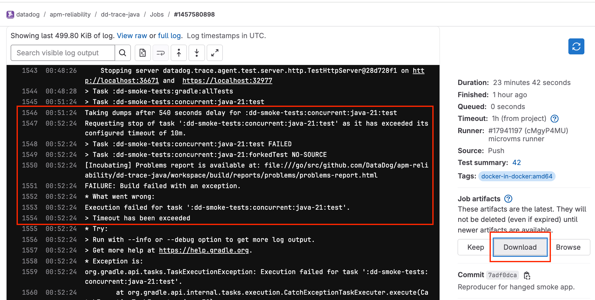
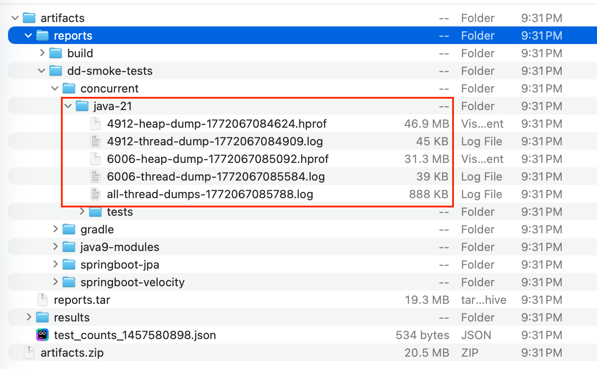
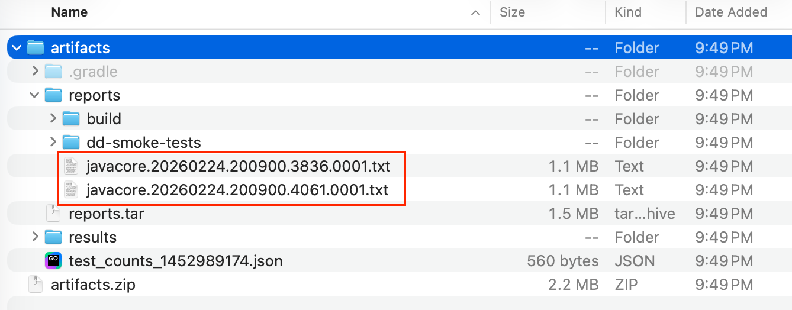

# Reproduce hanged smoke test and collect dumps (including child process)

Sometimes a smoke test that passes locally fails on CI.
Such tests can be found
on [Test optimization: Flaky Management](https://app.datadoghq.com/ci/test/flaky?query=%40git.repository.id_v2%3Agithub.com%2Fdatadog%2Fdd-trace-java%20%40test.suite%3A%2Asmoke%2A&sort=-pipelines_failed&viewMode=flaky).
An indicator of a potential problem in the smoke application is an error saying that a condition was not
satisfied after some time and several attempts.
For example:

```
Condition not satisfied after 30.00 seconds and 39 attempts
...
Caused by: Condition not satisfied:
decodeTraces.find { predicate.apply(it) } != null
```

With high probability this is hiding a real problem, usually a deadlock in the smoke application because of a potential
bug in instrumentation.
To investigate such issues we need thread and heap dumps for both the test and the smoke application started as a child
process.

This document describes several steps that will simplify collection of dumps. Some steps are optional and only reduce CI
turnaround time.

## Step 0: Setup

Create a branch for testing.

## Step 1 (optional): Modify build scripts to minimize CI time.

Modify `.gitlab-ci.yml`:

- Keep Java versions you want to test, for example Java 21 only:

```
DEFAULT_TEST_JVMS: /^(21)$/
```

- Comment out heavy jobs, like `check_base, check_inst, muzzle, test_base, test_inst, test_inst_latest`.

Modify `buildSrc/src/main/kotlin/dd-trace-java.configure-tests.gradle.kts`:

- Replace timeout of 20 mins with 10 mins:

```
timeout.set(Duration.of(10, ChronoUnit.MINUTES))
```

## Step 2: Modify target test.

Add special poll to `AbstractSmokeTest.groovy` that would prevent test from retry:

```
@Shared
protected final PollingConditions hangedPoll = new PollingConditions(timeout: 700, initialDelay: 0, delay: 5, factor: 2)
```

> [!NOTE]
> Use `timeout: 700` if you executed step 1, otherwise use `timeout: 1500`

This poll would literally wait until Gradle detects timeout and triggers thread and heap dumps collection by
`DumpHangedTestPlugin`.
Use this poll in test, something like this (usually just replace `defaultPoll` with `hangedPoll`):

```
waitForTrace(hangedPoll, checkTrace())
```

In other situations just make test continue to work longer than test timeout, for example with `Thread.sleep(XXX)`.
The main goal is to keep the test alive to allow dump collection for the smoke application.

## Step 3: Run test on CI and collect dumps.

- Commit your changes.
- Push the reproducer branch that will trigger the GitLab pipeline.
- Wait for the smoke test job to hit timeout.
- In job logs, confirm the dump hook executed (look for `Taking dumps after ... for :...`).
- Wait until the job fails and download job artifacts (see screenshot).
  

> [!NOTE]
> You may need to re-run CI several times if the bug is not reproduced on the first try.

## Step 4: Locate dumps by JVM type

### HotSpot/OpenJDK (heap + thread dumps):

- Open the report folder of the failed smoke module (the hanged test folder), for example under
  `reports/dd-smoke-tests/...`.
- There will be files, such as `<pid>-heap-dump-<timestamp>.hprof`, `<pid>-thread-dump-<timestamp>.log`, and
  `all-thread-dumps-<timestamp>.log`.
  

### IBM JDK (javacore thread dumps only):

- In this case dumps are produced via `kill -3` and written as `javacore` text files, basically thread dumps.
- Collect root-level javacore artifacts from `reports/`, for example `javacore.YYYYMMDD.HHMMSS.PID.SEQ.txt`.
  

## Step 5: Run the investigation

Use tools like Eclipse MAT, or simply ask Codex or Claude to analyze collected dumps.
