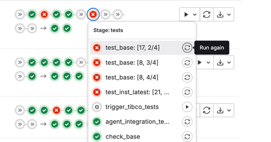
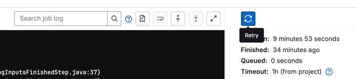

# How to Test

## The Different Types of Tests

The project leverages different types of tests:

1. The most common ones are **unit tests**.  
   They are intended to test a single isolated feature, and rely on [JUnit 5 framework](https://junit.org/junit5/docs/current/user-guide/) or [Spock 2 framework](https://spockframework.org/spock/docs/).
   * JUnit framework is recommended for most unit tests for its simplicity and performance reasons.
   * Spock framework provides an alternative for more complex test scenarios, or tests that require Groovy Script to access data outside their scope limitation (eg private fields).

2. A variant of unit tests is **instrumented tests**.  
   Their purpose is similar to unit tests, but the tested code is instrumented by the java agent (`:dd-trace-java:java-agent`) while running.
   They extend the Spock specification `datadog.trace.agent.test.InstrumentationSpecification` which produces traces and metrics for testing.

3. The third type of tests is **Muzzle checks**.  
   Their goal is to check the [Muzzle directives](./how_instrumentations_work.md#muzzle), making sure instrumentations are safe to load against specific library versions.

4. The fourth type of tests is **integration tests**.  
   They test features that require a more complex environment setup.
   In order to build such environment, integration tests use Testcontainers to set up the services needed to run the tests.

5. The fifth type of test is **smoke tests**.  
   They are dedicated to test the java agent (`:dd-java-agent`) behavior against demo applications to prevent any regression. All smoke tests are located into the `:dd-smoke-tests` module. 

6. The last type of test is **system tests**.  
   They are intended to test behavior consistency between all the client libraries, and rely on [their own GitHub repository](https://github.com/DataDog/system-tests).

> [!TIP]
> Most of the instrumented tests and integration tests are instrumentation tests.

### Forked Tests

Independent of the type of test, test can be run in another (forked) JVM than the one running Gradle.
This behavior is implicit when the test class name is suffixed by `ForkedTest` (eg `SomeFeatureForkedTest`).
This mechanism exists to make sure either java agent state or static data are reset between test runs.

> [!NOTE]
> Forked tests are not run as part of the gradle `test` task.
> In order to run them, you need to use the `forkedTest` task instead.

### Flaky Tests

If a test runs unreliably, or doesn't have a fully deterministic behavior, this will lead to recurrent unexpected errors in continuous integration.
In order to identify such tests and avoid the continuous integration to fail, they are marked as _flaky_ and must be annotated with the `@Flaky` annotation.

> [!TIP]
> In case your pull request checks failed due to some unexpected flaky tests, you can retry the continuous 
> integration pipeline on Gitlab 
> * using the `Run again` button from the pipeline view:
>    
> * using the `Retry` button from the job view:
>    

## Running Tests

You can run the whole project test suite using `./gradlew test` but expect it to take a certain time.
Instead, you can run tests for a specific module (ex. `:dd-java-agent:instrumentation:opentelemetry:opentelemetry-1.4`) using the test command for this module only: `./gradlew :dd-java-agent:instrumentation:opentelemetry:opentelemetry-1.4:test`.

> [!TIP]
> Flaky tests can be disabled by setting the Gradle property `skipFlakyTests` (ex. `./gradlew -PskipFlakyTests <task>`).

### Running Tests on Another JVM

To run tests on a different JVM than the one used for the build, you can specify it using the `-PtestJvm=` command line option to the Gradle task:

* `-PtestJvm=X` like `-PtestJvm=8`, `-PtestJvm=25` to run with a specific JDK version,
* `-PtestJvm=/path/to/jdk` to run with a given JDK,

### Running System Tests

The system tests are setup to run on continuous integration (CI) as pull request check using [a dedicated workflow]((https://github.com/DataDog/system-tests/blob/main/.github/workflows/system-tests.yml)).
To run them locally, grab a local copy of [the system tests](https://github.com/DataDog/system-tests) and run them from there.
You can make them use your development version of `dd-trace-java` by [dropping the built artifacts to the `/binaries` folder](https://github.com/DataDog/system-tests/blob/main/docs/execute/binaries.md#java-library) of your local copy of the system tests.

### The APM test agent

The APM test agent emulates the APM endpoints of the Datadog Agent.
The APM Test Agent container runs alongside Java tracer Instrumentation Tests in CI,
handling all traces during test runs and performing a number of `Trace Checks`.
Trace Check results are returned within the `Get APM Test Agent Trace Check Results` step for all instrumentation test jobs.
Check [trace invariant checks](https://github.com/DataDog/dd-apm-test-agent#trace-invariant-checks) for more information.

The APM Test Agent also emits helpful logging, including logging received traces' headers, spans, errors encountered, and information on trace checks being performed.

Logs can be viewed in GitLab within the Test-Agent container step for all instrumentation test suites, e.g. the `test_inst` jobs.
Read more about [the APM Test Agent](https://github.com/datadog/dd-apm-test-agent#readme).
