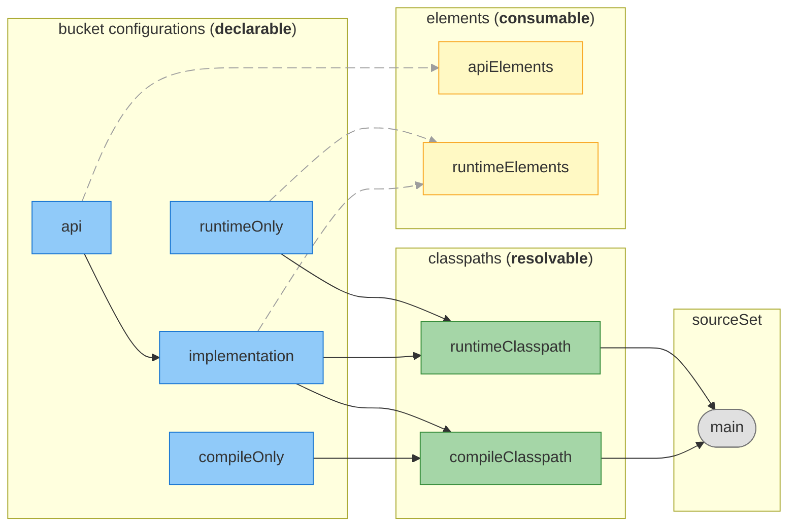
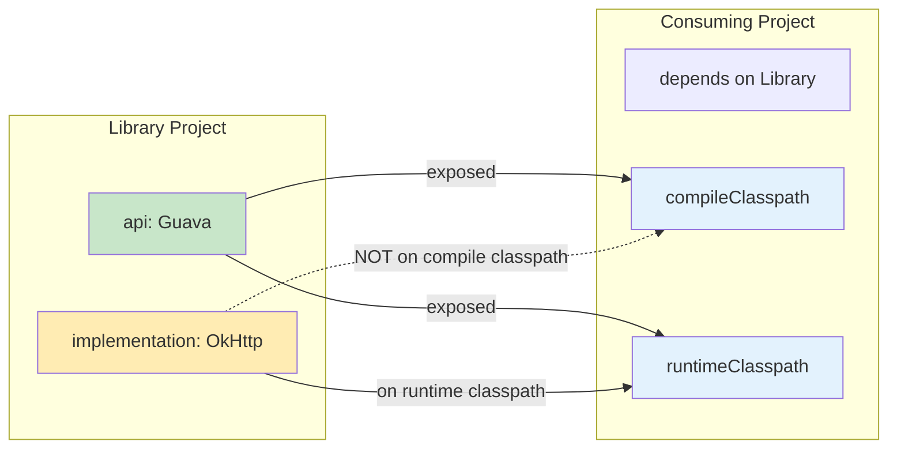
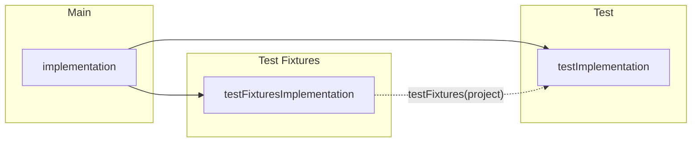
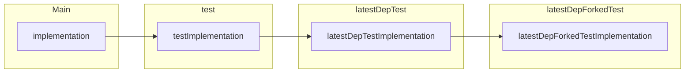

# How to Work with Gradle

This guide covers the fundamentals of working with Gradle in this project. Understanding these concepts will help you navigate the build system and contribute effectively.

## What are Gradle Files?

Gradle builds are defined through a set of build scripts. These scripts can be written in two Domain Specific Languages (DSLs): **Groovy DSL** and **Kotlin DSL**.

### Groovy DSL

The original Gradle DSL uses Groovy syntax. Files use the `.gradle` extension.

```Gradle
plugins {
    id 'java'
}

dependencies {
    implementation 'com.google.guava:guava:32.1.2-jre'
}

tasks.register('hello') {
    doLast {
        println 'Hello from Groovy DSL'
    }
}
```

> [!NOTE]
> Ideally, prefer the Kotlin DSL approach as it has better IDE support. However, due to the
> _script plugins_ this is not always possible in an easy way.

### Kotlin DSL

The Kotlin DSL offers type-safety, better IDE support, and compile-time checking. Files use the `.gradle.kts` extension.

```Gradle Kotlin DSL
plugins {
    id("java")
}

dependencies {
    implementation("com.google.guava:guava:32.1.2-jre")
}

tasks.register("hello") {
    doLast {
        println("Hello from Kotlin DSL")
    }
}
```

Key differences at a glance:

| Aspect              | Groovy DSL               | Kotlin DSL                             |
|---------------------|--------------------------|----------------------------------------|
| File extension      | `.gradle`                | `.gradle.kts`                          |
| String quotes       | Single `'` or double `"` | Double `"` only                        |
| Method calls        | Parentheses optional     | Parentheses required                   |
| Property assignment | `=` optional             | `=` required (mostly)                  |
| IDE support         | Limited                  | Full auto-completion and refactoring   |
| Type safety         | Dynamic typing           | Static typing with compile-time checks |

## Gradle Build Lifecycle

Gradle executes builds in distinct phases. Understanding this lifecycle is essential for writing correct and efficient build logic.

### 1. Initialization Phase

Gradle determines which projects are part of the build. It executes:

- **`init.gradle`** (or scripts in `~/.gradle/init.d/`): Global initialization scripts that run before any project is evaluated
- **`settings.gradle.kts`**: Defines the main repository project structure and discovers subprojects

```Gradle Kotlin DSL
// settings.gradle.kts
rootProject.name = "my-project"

include("module-a")
include("module-b")
include("module-c:submodule")
```

### 2. Configuration Phase

Gradle evaluates all build scripts of the participating projects. During this phase:

- Build scripts (`build.gradle.kts`) are executed
- Tasks are registered and configured
- The task graph is constructed based on dependencies

> [!NOTE]
> Code in the configuration phase runs on **every** build invocation, even if the requested task doesn't need it. Keep configuration-time logic fast and avoid I/O operations.

```Gradle Kotlin DSL
// build.gradle.kts
plugins {
    id("java")
}

// This runs during CONFIGURATION - avoid expensive operations in this phase
val expensiveValue = file("some-file.txt").readText() // Bad!

tasks.register("myTask") {
    // Task configuration also runs during configuration phase
    // But the task ACTION (doLast/doFirst) runs during execution
    doLast {
        // This runs during EXECUTION phase
        println("Executing myTask")
    }
}
```

### 3. Execution Phase

Gradle executes the selected tasks in dependency order. 
Only tasks required to complete the requested goal are executed.

```
./gradlew build

> Task :compileJava
> Task :processResources
> Task :classes
> Task :jar
> Task :assemble
> Task :compileTestJava
> Task :testClasses
> Task :test
> Task :check
> Task :build
```

### Build Logic Location

In a well-organized Gradle project, build logic lives in specific places:

| Location              | Purpose                                                                                            |
|-----------------------|----------------------------------------------------------------------------------------------------|
| `settings.gradle.kts` | Project structure, repository settings, plugin management                                          |
| `build.gradle.kts`    | Project-specific build configuration                                                               |
| `buildSrc/`           | Build logic automatically included by Gradle; contains convention plugins and shared configuration |
| `gradle/`             | Version catalogs and wrapper files and script plugins                                              |

> [!CAUTION]
> Script plugins are not recommended. The best practice for developing our build logic in plugins is 
> to create _convention plugins_ or _binary plugins_.


## Gradle Configurations

Configurations are a fundamental concept in Gradle's dependency management system. Understanding them is essential for working effectively with the build.

### What Are Configurations?

A **configuration** is a named collection of dependencies that serves a specific purpose in the build. Think of configurations as labeled buckets where you place dependencies based on how they should be used.

```Gradle Kotlin DSL
dependencies {
    // "implementation" is a configuration
    implementation("com.google.guava:guava:32.1.2-jre")

    // "testImplementation" is another configuration
    testImplementation("org.junit.jupiter:junit-jupiter:5.10.0")
}
```

Configurations serve two main purposes:

1. **Declaring dependencies**: You add dependencies to configurations to express what your project needs
2. **Resolving dependencies**: Gradle uses configurations to compute the full dependency graph (including transitives)

> [!TIP]
> The full flow:
> 1. You declare dependencies in **declarable** configurations
> 2. Gradle resolves them into **resolvable** classpaths
> 3. Two usual consumers:
>    - **Source set** (via tasks) uses **resolvable** classpaths to compile/run
>    - **Other projects** consume via **consumable** `apiElements`/`runtimeElements`


### Declarable vs Resolvable vs Consumable

Configurations have three key attributes that define their role:

| Attribute                        | Description                                                                  |
|----------------------------------|------------------------------------------------------------------------------|
| **Declarable** (`canBeDeclared`) | Can have dependencies added to it directly in the `dependencies {}` block    |
| **Resolvable** (`canBeResolved`) | Can be resolved to produce a set of files (e.g., for compilation or runtime) |
| **Consumable** (`canBeConsumed`) | Can be consumed by other projects as a dependency                            |

> [!IMPORTANT]
> These three roles are **mutually exclusive**. Each configuration should have exactly one role enabled. A single configuration should not attempt to declare, resolve, and expose simultaneously.

Most configurations you interact with are **declarable only** — they're buckets where you put dependencies. Gradle then creates internal configurations that are **resolvable** (to get the actual files) or **consumable** (to expose artifacts to dependent projects).

> [!NOTE]
> You rarely interact with resolvable or consumable configurations directly. Gradle creates and manages them automatically when you apply plugins like `java` or `java-library`.

### The Java Library Plugin Configurations

When you apply the `java-library` plugin, Gradle creates a comprehensive set of configurations. The following diagram shows the relationships between them (based on the [official Gradle documentation](https://docs.gradle.org/current/userguide/java_library_plugin.html#sec:java_library_configurations_graph)):



**Legend:**             

| Block Color | Role       | Description                                                                        |
|-------------|------------|------------------------------------------------------------------------------------|
| 🔵 Blue     | Declarable | Where you add dependencies (`api`, `implementation`, `compileOnly`, `runtimeOnly`) |
| 🟢 Green    | Resolvable | Used by tasks to get files (`compileClasspath`, `runtimeClasspath`)                |
| 🟡 Yellow   | Consumable | Exposed to consumer projects (`apiElements`, `runtimeElements`)                    |
| ⬜ Gray      | Tasks      | Gradle tasks that use the configurations                                           |

| Configuration    | Compile Classpath | Runtime Classpath | Exposed to Consumers | Use Case                                                      |
|------------------|:-----------------:|:-----------------:|:--------------------:|---------------------------------------------------------------|
| `api`            |         ✅         |         ✅         |          ✅           | Types in your public API (method signatures, return types)    |
| `implementation` |         ✅         |         ✅         |          ❌           | Internal dependencies not exposed to consumers                |
| `compileOnly`    |         ✅         |         ❌         |          ❌           | Provided at runtime by the environment (e.g., `servlet-api`)  |
| `compileOnlyApi` |         ✅         |         ❌         |          ✅           | Compile-only dependency that's part of the public API         |
| `runtimeOnly`    |         ❌         |         ✅         |          ❌           | Needed only at runtime (e.g., JDBC drivers, logging backends) |

> [!NOTE]
> `compileOnlyApi` flows to `apiElements` (so consumers see it at compile time), i.e. the existing `apiElements` 
> handles both `api` and `compileOnlyApi` exposure.

### The `api` vs `implementation` Distinction

The key difference between `api` and `implementation` is **transitive exposure to consumers**:



| Configuration    | Transitive to Consumers' Compile | Transitive to Consumers' Runtime | When to Use                                                      |
|------------------|:--------------------------------:|:--------------------------------:|------------------------------------------------------------------|
| `api`            |                ✅                 |                ✅                 | Types appear in project's public API                             |
| `implementation` |                ❌                 |                ✅                 | Project's internal implementation detail, not part of public API |

**Example:**

```Gradle Kotlin DSL
// java-library plugin required for 'api'
plugins {
    `java-library`
}

dependencies {
    // Guava types appear in public method signatures → use api
    api("com.google.guava:guava:32.1.2-jre")

    // OkHttp is used internally, not exposed → use implementation
    implementation("com.squareup.okhttp3:okhttp:4.12.0")
}
```

```java
public class MyService {
    // Guava's ImmutableList is in the public API → needs 'api'
    public ImmutableList<String> getItems() {
        return ImmutableList.of("a", "b");
    }

    // OkHttpClient is private, only used internally → 'implementation' is fine
    private final OkHttpClient client = new OkHttpClient();
}
```

> [!TIP]
> **Prefer `implementation` over `api`** when dependencies are internal. Using `implementation` keeps dependencies 
> hidden from other projects, which:
> - Reduces consumers' compile classpath (faster compilation)
> - Allows changing dependencies without breaking consumers
> - Avoids version conflicts in dependent projects

### Configuration Inheritance with `extendsFrom`

Configurations can inherit dependencies from other configurations using `extendsFrom`. When configuration A extends configuration B, A automatically includes all dependencies from B.

**Built-in inheritance:** The Java plugin automatically sets up inheritance so test code can use production dependencies:



**Custom configurations:** Use `extendsFrom` when creating your own configurations that should inherit from existing ones:

```Gradle Kotlin DSL
// Create a declarable configuration for integration tests
val integrationTestImplementation by configurations.dependencyScope("integrationTestImplementation") {
    extendsFrom(configurations.named("testImplementation").get())
}

dependencies {
    // Gets all testImplementation deps automatically via inheritance
    integrationTestImplementation("org.testcontainers:testcontainers:1.19.0")
}
```

### Test Suite Configurations

Each test suite (like `test`, `integrationTest`) gets its own set of configurations that mirror the main ones.

In this project, the `gradle/test-suites.gradle` script provides helpers to create test suites with proper configuration inheritance:

| Helper                                                 | Description                                                                    |
|--------------------------------------------------------|--------------------------------------------------------------------------------|
| `addTestSuite('name')`                                 | Creates `name` test suite extending `test`, sources in `src/name/`             |
| `addTestSuiteForDir('name', 'dir')`                    | Creates `name` test suite extending `test`, sources in `src/dir/`              |
| `addTestSuiteExtendingForDir('name', 'parent', 'dir')` | Creates `name` test suite extending `parent` test suite, sources in `src/dir/` |

For example:

```Gradle
// Creates 'latestDepTest' suite extending 'test', sources in src/latestDepTest/
addTestSuite('latestDepTest')

// Creates 'latestDepForkedTest' suite extending 'latestDepTest', sources in src/latestDepTest/
addTestSuiteExtendingForDir('latestDepForkedTest', 'latestDepTest', 'latestDepTest')
```



*Similar inheritance applies to `compileOnly`, `runtimeOnly`, and `annotationProcessor` configurations.*

### Creating Custom Configurations

You can create configurations for special purposes. Use the factory methods to explicitly document intent and set the appropriate flags automatically:

```Gradle Kotlin DSL
// A resolvable configuration for tools that generate code
// Use resolvable() - we want to resolve it to get files, not expose to others
val codeGenerator by configurations.resolvable("codeGenerator")

dependencies {
    codeGenerator("com.example:my-generator:1.0")
}

// Use the resolved files in a task
tasks.register("generateCode") {
    val generatorClasspath = configurations.named("codeGenerator")
    inputs.files(generatorClasspath)
    doLast {
        // generatorClasspath.get().files contains the resolved JARs
    }
}
```

**Factory methods for custom configurations:**

| Factory Method         | Role       | Use Case                                                      |
|------------------------|------------|---------------------------------------------------------------|
| `resolvable(...)`      | Resolvable | Resolve to get files (e.g., tool classpaths, code generators) |
| `consumable(...)`      | Consumable | Expose artifacts to other projects                            |
| `dependencyScope(...)` | Declarable | Bucket for declaring dependencies                             |

> [!TIP]
> Prefer factory methods over manually setting `isCanBeResolved`/`isCanBeConsumed` flags. They make 
> the configuration's purpose explicit and prevent accidental misconfiguration.

### Viewing Configurations

To see all configurations and their relationships:

```bash
# List all configurations
./gradlew :my-project:dependencies

# Show a specific configuration's dependency tree
./gradlew :my-project:dependencies --configuration runtimeClasspath

# Show all resolvable configurations
./gradlew :my-project:resolvableConfigurations
```

## Useful dd-trace-java Extensions

This project provides several custom Gradle extensions to manage multi-JVM testing, multi-version source sets, and CI optimizations.

### `testJvmConstraints` Extension

Controls which JVM versions are allowed to run tests. Applied via the `dd-trace-java.test-jvm-contraints` plugin.

```Gradle Kotlin DSL
plugins {
    id("dd-trace-java.test-jvm-contraints")
}

// project-wide constraints (apply to all Test tasks by default)
testJvmConstraints {
    minJavaVersion.set(JavaVersion.VERSION_11)
    maxJavaVersion.set(JavaVersion.VERSION_21)
    excludeJdk.add("IBM8")
    allowReflectiveAccessToJdk.set(true)
}

// task-specific constraints (override project defaults for this task)
tasks.named<Test>("latestDepTest") {
    testJvmConstraints {
        minJavaVersion.set(JavaVersion.VERSION_17)  // requires Java 17+ for this test suite
    }
}
```

| Property                     | Description                                             |
|------------------------------|---------------------------------------------------------|
| `minJavaVersion`             | Minimum JDK version allowed for tests                   |
| `maxJavaVersion`             | Maximum JDK version allowed for tests                   |
| `forceJdk`                   | List of JDK names to force (overrides version checks)   |
| `includeJdk`                 | JDK names to include                                    |
| `excludeJdk`                 | JDK names to exclude                                    |
| `allowReflectiveAccessToJdk` | Adds `--add-opens` flags for Java 16+ reflective access |

**Running tests with a specific JVM:**

```bash
./gradlew allTests -PtestJvm=zulu11
```

### `tracerJava` Extension

Manages multi-version Java source sets, allowing a single project to compile code targeting different JVM versions.

```Gradle Kotlin DSL
// In build.gradle.kts
apply(from = "$rootDir/gradle/java.gradle")

tracerJava {
    addSourceSetFor(JavaVersion.VERSION_11) {
        applyForTestSources = true   // Apply version constraints to tests, default
    }
}
```

This creates source sets for version-specific code:

```
src/
  main/
    java/        # Java 8 code (default)
    java11/      # Java 11 specific code
  test/
    java/        # Compiled as Java 11     
```

### CI Slots and Parallelization

Distributes test execution across multiple CI jobs using hash-based project slotting.

```bash
# Run only projects assigned to slot 2 out of 4 parallel jobs
./gradlew test -Pslot=2/4

# Without slot parameter, all projects run
./gradlew test
```

Projects are assigned to slots based on a hash of their path, ensuring consistent distribution across builds.

### Git Change Tracking

Optimizes CI by skipping tests for projects unaffected by git changes.

```bash
# Only run tests for projects with changes between master and HEAD
./gradlew baseTest -PgitBaseRef=master

# Specify both refs explicitly
./gradlew baseTest -PgitBaseRef=master -PgitNewRef=feature-branch
```

The system:
- Detects changed files via `git diff`
- Maps changes to affected projects
- Skips tests for unchanged projects
- Falls back to running all tests if "global effect" files change (e.g., `gradle/`, `build.gradle`)

### Root Aggregate Tasks

The root `build.gradle.kts` defines aggregate tasks that orchestrate testing across subprojects with slot filtering and git change tracking.

| Task                                                                            | Projects Included                                               |
|---------------------------------------------------------------------------------|-----------------------------------------------------------------|
| `baseTest` / `baseLatestDepTest` / `baseCheck`                                  | All projects except smoke, instrumentation, profiling, debugger |
| `instrumentationTest` / `instrumentationLatestDepTest` / `instrumentationCheck` | `:dd-java-agent:instrumentation`                                |
| `smokeTest` / `smokeLatestDepTest` / `smokeCheck`                               | `:dd-smoke-tests`                                               |
| `profilingTest` / `profilingLatestDepTest` / `profilingCheck`                   | `:dd-java-agent:agent-profiling`                                |
| `debuggerTest` / `debuggerLatestDepTest` / `debuggerCheck`                      | `:dd-java-agent:agent-debugger`                                 |

**Combined usage:**

```bash
# Run instrumentation tests in slot 1/4, only for changed projects, with coverage
./gradlew instrumentationTest -Pslot=1/4 -PgitBaseRef=main -PcheckCoverage
```

> [!NOTE]
> These root tasks are defined using `testAggregate()` in `build.gradle.kts`. They combine CI slot filtering,
> git change tracking, and optional JaCoCo coverage into convenient entry points for CI pipelines.

## Convention Plugins

Convention plugins are the recommended way to share build logic across projects. They encapsulate
common configuration patterns and can be applied like any other plugin.

> [!TIP]
> Convention plugins promote consistency across modules. Instead of copy-pasting configuration,
> define it once and apply it everywhere.

### Project Convention Plugins

Files ending in `.gradle.kts` placed in `buildSrc/src/main/kotlin/` target `Project` and can configure tasks, dependencies, and extensions. The `buildSrc/` directory is automatically included by Gradle before the main build.

In this project, convention plugins use the `dd-trace-java.` prefix. For example, `dd-trace-java.configure-tests.gradle.kts` configures test tasks across all subprojects:

```Gradle Kotlin DSL
// buildSrc/src/main/kotlin/dd-trace-java.configure-tests.gradle.kts (excerpt)

// Use lazy providers to avoid evaluating the property until it is needed
val skipTestsProvider = rootProject.providers.gradleProperty("skipTests")
val skipForkedTestsProvider = rootProject.providers.gradleProperty("skipForkedTests")

// Go through the Test tasks and configure them
tasks.withType<Test>().configureEach {
  // Disable all tests if skipTests property was specified
  onlyIf("skipTests are undefined or false") { !skipTestsProvider.isPresent }

  // Set test timeout for 20 minutes
  timeout.set(Duration.of(20, ChronoUnit.MINUTES))
  
  // ...
}
```

Apply it in any subproject:

```Gradle Kotlin DSL
// dd-java-agent/instrumentation/some-integration/build.gradle.kts
plugins {
    id("dd-trace-java.configure-tests")
}
```

Other convention plugins in this project include:
- `dd-trace-java.gradle-debug` - Debugging utilities for build diagnostics
- `dd-trace-java.dependency-locking` - Dependency locking configuration
- `dd-trace-java.test-jvm-contraints` - JVM constraints for test execution

### Settings Convention Plugins

Files ending in `.settings.gradle.kts` target `Settings` and can configure repository declarations, plugin management, and build structure.

```Gradle Kotlin DSL
// buildSrc/src/main/kotlin/my-settings-convention.settings.gradle.kts
dependencyResolutionManagement {
    repositories {
        mavenCentral()
    }
}
```

## Script Plugins

Script plugins are standalone `.gradle` or `.gradle.kts` files that can be applied using the `apply from:` syntax. In this project, they are located in the `gradle/` directory.

```Gradle Kotlin DSL
// Applying a script plugin
apply(from = "$rootDir/gradle/some-script.gradle")
```

> [!WARNING]
> **Script plugins are deprecated.** Gradle 9 documentation no longer mentions them as a recommended practice. They bring several issues:
>
> - **No type safety**: When written in Groovy DSL, you lose IDE support and compile-time checking
> - **Mixed DSL confusion**: Projects often end up with a mix of Groovy and Kotlin scripts
> - **Poor discoverability**: Applied scripts are harder to trace than plugin IDs
> - **No caching**: Script plugins are re-evaluated on every build
>
> **Migrate to convention plugins** in `buildSrc/` or an included build (like `build-logic/`) for better maintainability and performance.

## Gradle Lazy API

Each time Gradle is invoked it project **must** go through the Gradle **Configuration phase**, in which it 
evaluates all build scripts of the participating projects. Any expensive actions in this phase will be run
_every single time_.

This means inefficient configuration directly impacts developer experience by slowing down all builds
— regardless of which tasks actually execute. While time savings per individual task may seem modest,
they compound quickly: **dd-trace-java has ~630 projects and ~33,000 tasks**. At that scale, even small
inefficiencies add up significantly.

The solution is Gradle's **lazy API**: make task creation and configuration as lazy as possible, so Gradle only realizes and configures objects it actually needs to execute.

### Why Lazy Configuration Matters

When you use eager APIs, values are computed immediately during configuration—even if the task never runs. Lazy APIs defer this work to execution time, and Gradle can automatically track dependencies between producers and consumers.

### Eager vs Lazy API Comparison

| Eager (Don't ❌)                 | Lazy (Prefer ✅)                        | Notes                                                                  |
|---------------------------------|----------------------------------------|------------------------------------------------------------------------|
| `configurations.getByName("x")` | `configurations.named("x")`            | Returns a `NamedDomainObjectProvider` instead of resolving immediately |
| `tasks.getByName("x")`          | `tasks.named("x")`                     | Avoids triggering task creation/configuration                          |
| `tasks.findByName("x")`         | `tasks.named("x")`                     | Returns `null` if not found, but still realizes the task               |
| `tasks.findByPath(":x")`        | `tasks.named("x")` on target project   | Realizes task eagerly; use project reference with `named()` instead    |
| `tasks.create("x")`             | `tasks.register("x")`                  | Task is only created when needed                                       |
| `property.set(someValue)`       | `property.set(provider { someValue })` | Defers computation of the value                                        |
| `collection.all { }`            | `collection.configureEach { }`         | Configures lazily as elements are realized                             |
| `collection.forEach { }`        | `collection.configureEach { }`         | Avoids forcing realization of all elements                             |
| `file(path).exists()`           | Use task inputs/outputs                | Let Gradle track file dependencies                                     |
| `exec { }.exitValue`            | See Exec pattern below                 | Avoid running processes at configuration time                          |

> [!IMPORTANT]
> Any function that iterates over a collection (`forEach`, `map`, `filter`, `all`, `any`, `find`, `first`, etc.) will **eagerly realize all elements**. This defeats lazy configuration. Always prefer `configureEach` for configuration, or use `named`/`withType` to get lazy providers.

> [!WARNING]
> **Groovy DSL pitfall**: The shorthand syntax `name { }` is **eager** for both tasks and configurations. It calls `getByName()` under the hood, which realizes the element and its dependencies immediately.
>
> ```Gradle
> // ❌ Eager - realizes the task immediately
> compileLatestDepJava {
>     options.encoding = 'UTF-8'
> }
>
> // ✅ Lazy - configures only when needed
> tasks.named('compileLatestDepJava') {
>     options.encoding = 'UTF-8'
> }
> ```
>
> ```Gradle
> // ❌ Eager - resolves the configuration immediately
> runtimeClasspath {
>     exclude group: 'org.slf4j'
> }
>
> // ✅ Lazy - configures only when needed
> configurations.named('runtimeClasspath') {
>     exclude group: 'org.slf4j'
> }
> ```

### Task Registration

```Gradle Kotlin DSL
// ❌ Eager - task is created immediately
tasks.create("processData") {
    // configuration runs now, even if task is never executed
}

// ✅ Lazy - task is created only when needed
tasks.register("processData") {
    // configuration runs only when this task is in the execution graph
}
```

### Configuration Access

```Gradle Kotlin DSL
// ❌ Eager - resolves configuration immediately
val runtimeClasspath = configurations.getByName("runtimeClasspath")

// ✅ Lazy - returns a provider
val runtimeClasspath = configurations.named("runtimeClasspath")
```

### Walking Collections

```Gradle Kotlin DSL
// ❌ Eager - forces all tasks to be created
tasks.all {
    if (this is JavaCompile) {
        options.encoding = "UTF-8"
    }
}

// ✅ Lazy - configures each task as it's realized
tasks.withType<JavaCompile>().configureEach {
    options.encoding = "UTF-8"
}
```

### Using Providers

```Gradle Kotlin DSL
// ❌ Eager - version is read immediately
tasks.register<Jar>("myJar") {
    archiveVersion.set(project.version.toString())
}

// ✅ Lazy - version is read when the jar task runs
tasks.register<Jar>("myJar") {
    archiveVersion.set(project.provider { project.version.toString() })
}
```

### Lazy JVM Arguments and System Properties

A common pitfall is reading task outputs or other values during configuration. Here's how to pass values lazily to `Test` or `JavaExec` tasks using `CommandLineArgumentProvider`:

```Gradle
// ❌ Eager - task output is resolved at configuration time
tasks.withType(Test).configureEach {
    def fooShadowJarTask = tasks.named('fooShadowJar', ShadowJar)
    def barShadowJarTask = tasks.named('barShadowJarTask', ShadowJar)
    dependsOn fooShadowJarTask, barShadowJarTask
    
    // This resolves the archive path immediately during configuration!
    systemProperty "smoketest.foo.path", fooShadowJarTask.get().archiveFile.get()
    environment "BAR_PATH", barShadowJarTask.get().archiveFile.get()
}

// ✅ Lazy - use CommandLineArgumentProvider to defer resolution
tasks.withType(Test).configureEach {
    def fooShadowJarTask = tasks.named('fooShadowJar', ShadowJar)
    def barShadowJarTask = tasks.named('barShadowJarTask', ShadowJar)
    dependsOn fooShadowJarTask, barShadowJarTask

    jvmArgumentProviders.add(new CommandLineArgumentProvider() {
        @Override
        Iterable<String> asArguments() {
            // This is only called at execution time
            return fooShadowJarTask.map { ["-Dsmoketest.foo.path=${it.archiveFile.get()}"] }.get()
        }
    })
    
    // Workaround: environment() calls toString() at execution time
    environment("BAR_PATH", new Object() {
        @Override
        String toString() {
            return barShadowJarTask.get().archiveFile.get().asFile.absolutePath
        }
    })
}
```

> [!TIP]
> `CommandLineArgumentProvider` is the recommended way to pass lazily-computed JVM arguments. 
> It's configuration-cache compatible and properly tracks inputs for up-to-date checks. However, 
> for older APIs like `environment()` that don't accept providers, use the `toString()` wrapper 
> trick: pass an anonymous object whose `toString()` method computes the value—it will only be 
> called at execution time.

### Benefits of Lazy Configuration

1. **Faster configuration**: Only necessary work is performed
2. **Automatic dependency tracking**: Gradle knows which tasks produce values that others consume
3. **Configuration cache compatibility**: Lazy providers are serializable and can be cached
4. **Correct ordering**: Task dependencies are inferred from provider relationships

## Gradle Daemon JVM

The Gradle Daemon is a long-lived background process that speeds up builds by avoiding JVM startup costs and caching project information. Configuring the Daemon JVM ensures consistent build behavior across machines.

### Daemon JVM Criteria

You can specify criteria for the JVM that runs the Gradle Daemon. This is configured in `gradle/gradle-daemon-jvm.properties`:

```properties
# gradle/gradle-daemon-jvm.properties
toolchainVersion=21
```

When this file exists, Gradle will automatically provision a JVM matching the criteria using toolchain resolvers. This ensures all developers and CI systems use the same JVM version to run the build, regardless of their local `JAVA_HOME`.

> [!NOTE]
> The Daemon JVM is separate from the toolchain used to compile your code. The Daemon JVM runs Gradle itself, while compilation toolchains (configured via `java.toolchain`) compile your source files.

### Updating the Daemon JVM

To change the Daemon JVM version, use the built-in `updateDaemonJvm` task:

```bash
# Update to a specific JVM version
./gradlew updateDaemonJvm --jvm-version=21
```

This task updates the `gradle/gradle-daemon-jvm.properties` file with the new criteria. Commit this file to version control so the entire team uses the same Daemon JVM.

> [!CAUTION]
> Not using this task will break the JDK auto-provisioning for the Gradle Daemon.

## Troubleshooting

When Gradle builds fail or behave unexpectedly, several tools and techniques can help diagnose the problem.

### Build Scans (Develocity)

This project uses [Gradle Develocity](https://gradle.com/) for build scans. Build scans provide detailed insights into build performance, dependency resolution, and failures.

```bash
# Generate a build scan (requires accepting terms of use)
./gradlew build --scan
```

On CI, build scans are automatically published (unless `SKIP_BUILDSCAN=true`). The scan URL is printed at the end of the build output.

**What build scans show:**
- Build timeline and task execution order
- Dependency resolution details and conflicts
- Test results with failure details
- Configuration cache hits/misses
- Build cache effectiveness

**For performance analysis**, focus on these sections:

| Section                              | What to look for                                                   |
|--------------------------------------|--------------------------------------------------------------------|
| **Performance** → **Build**          | Total build time breakdown: configuration vs execution vs overhead |
| **Performance** → **Configuration**  | Slow scripts, plugin apply times, expensive configuration logic    |
| **Performance** → **Task execution** | Parallelism utilization, task wait times, serial bottlenecks       |
| **Timeline**                         | Visual task execution, look for long sequential chains             |
| **Timeline** → **Critical path**     | Tasks that directly impact total build time—optimize these first   |
| **Build cache**                      | Cache hit rates, "not cacheable" tasks that could be               |
| **Dependency resolution**            | Slow repositories, resolution time per configuration               |

> [!TIP]
> The **critical path** shows tasks that directly determine build duration. Parallelizing or speeding up
> tasks *not* on the critical path won't reduce total build time.

**Diagnosing tasks that should be UP-TO-DATE but aren't:**

1. **In build scans**: Navigate to **Timeline** → click on the task → **Inputs** tab. Look for inputs that change unexpectedly between builds (timestamps, absolute paths, non-deterministic values). The **Outcome** section also shows the reason for execution (e.g., "Input property 'source' has changed").

2. **With `--info` flag**: Gradle logs why each task executed (same info as build scans but locally):
   ```bash
   ./gradlew :my-project:compileJava --info
   # Look for: "Task ':my-project:compileJava' is not up-to-date because:"
   #   - "Input property 'source' file /path/to/File.java has changed."
   #   - "Output property 'destinationDirectory' file /path/to/classes has been removed."
   ```

3. **Common causes of unexpected re-execution**:
   - Undeclared inputs (task reads files not tracked as inputs)
   - Non-reproducible inputs (timestamps, random values, absolute paths)
   - Outputs modified by another task or external process
   - Missing `@PathSensitive` annotation causing full path comparison instead of relative

### Diagnostic Flags

Gradle provides several flags to increase output verbosity:

| Flag                | Description                                                  |
|---------------------|--------------------------------------------------------------|
| `--info`            | Adds informational log messages (recommended starting point) |
| `--debug`           | Very verbose output including internal Gradle operations     |
| `--stacktrace`      | Prints stack traces for exceptions                           |
| `--full-stacktrace` | Prints full stack traces (including internal frames)         |
| `--scan`            | Generates a build scan with detailed diagnostics             |
| `--dry-run` / `-m`  | Shows which tasks would run without executing them           |
| `--console=verbose` | Shows all task outcomes including UP-TO-DATE                 |

```bash
# Diagnose a failing task with info logging
./gradlew :my-project:test --info

# See full exception details
./gradlew build --stacktrace

# Combine for thorough diagnosis
./gradlew build --info --stacktrace --scan
```

### The `gradle-debug` Convention Plugin

This project includes a debug plugin that logs JDK information for all tasks. Enable it with `-PddGradleDebug`:

```bash
./gradlew build -PddGradleDebug
```

This writes JSON-formatted task/JDK mappings to `build/datadog.gradle-debug.log`:

```json
{"task":":dd-trace-api:compileJava","jdk":"8"}
{"task":":dd-trace-api:test","jdk":"11"}
```

Use this to diagnose JDK-related issues, especially when tasks use unexpected Java versions.

### Common Issues and Solutions

**"Could not resolve dependency"**

```bash
# Check dependency resolution details
./gradlew :my-project:dependencies --configuration runtimeClasspath

# Force refresh of dependencies
./gradlew build --refresh-dependencies
```

**"Task ... uses this output of task ... without declaring an explicit or implicit dependency"**

This indicates a missing task dependency. The producing task must be declared as a dependency:

```Gradle Kotlin DSL
tasks.named("consumingTask") {
    // Declare the dependent task outputs as inputs of this task
    inputs.files(tasks.named("producingTask").map { it.outputs })
    
    // If that doesn't work track the dependency
    dependsOn(tasks.named("producingTask"))
}
```

**Out of memory errors**

Increase Gradle daemon memory in `gradle.properties`:

```properties
org.gradle.jvmargs=-Xmx4g -XX:+HeapDumpOnOutOfMemoryError
```

**Daemon seems stuck or slow**

```bash
# Stop all daemons and start fresh
./gradlew --stop
./gradlew build
```

### Configuration Cache Issues

The configuration cache speeds up builds by caching the task graph. However, some code patterns are incompatible.

**Common configuration cache violations:**

1. **Capturing `Project` at execution time:**
   ```Gradle Kotlin DSL
   // ❌ Bad - captures Project reference
   tasks.register("myTask") {
       doLast {
           println(project.version)  // Not allowed!
       }
   }

   // ✅ Good - capture value at configuration time
   tasks.register("myTask") {
       val version = project.version
       doLast {
           println(version)
       }
   }
   ```

2. **Using `Task.project` in task actions:**
   ```Gradle Kotlin DSL
   // ❌ Bad
   tasks.register("myTask") {
       doLast {
           copy {
               from(project.file("src"))  // Not allowed!
           }
       }
   }

   // ✅ Good - use task properties
   tasks.register<Copy>("myTask") {
       from("src")
   }
   ```

**Diagnosing configuration cache problems:**

```bash
# Run with configuration cache and see what fails
./gradlew build --configuration-cache

# Generate a detailed report
./gradlew build --configuration-cache --configuration-cache-problems=warn
```

The report shows exactly which code paths capture disallowed references.

### Useful Diagnostic Tasks

```bash
# Show project structure
./gradlew projects

# List all tasks in a project
./gradlew :my-project:tasks --all

# Show applied plugins
./gradlew :my-project:buildEnvironment

# Show all resolvable configurations
./gradlew :my-project:resolvableConfigurations

# Show outgoing variants (what this project exposes)
./gradlew :my-project:outgoingVariants

# Validate build logic without running tasks
./gradlew help --scan
```

