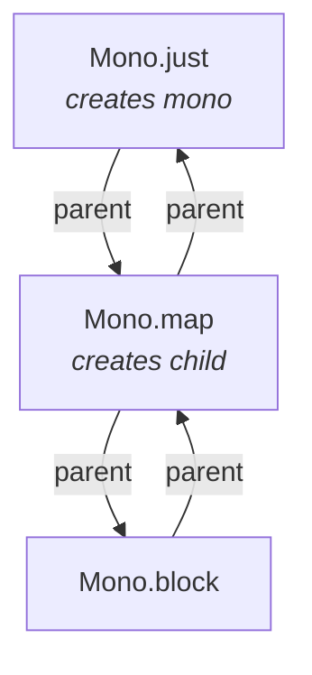
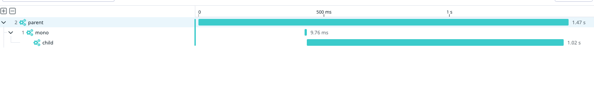
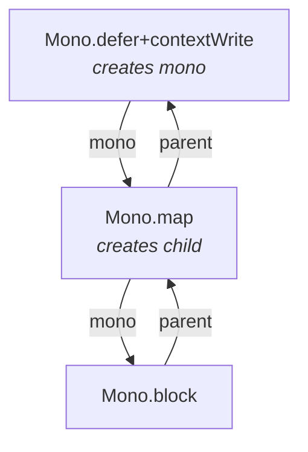
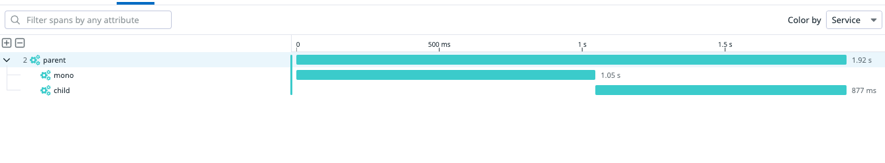
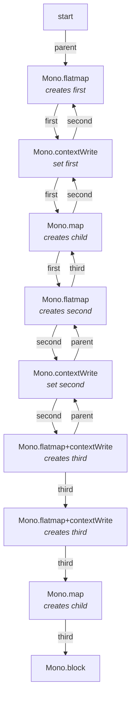
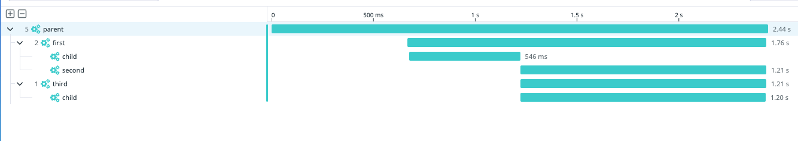

# Reactor with dd-trace-java

This project shows basic examples of manual tracing with reactor and the datadog java tracer.
The examples are provided in the form of Junit tests. Manual tracing is achieved using the opentelemetry APIs.

## Get started

The project is configured to run with a JDK 17 and Apache maven.
To get started on a command line, just type `mvn test`. It will generate and log traces in a json format on the
console.

## How the context is propagated

The Reactor context propagates bottom up from the first subscriber (last publisher) to the last subscriber (first publisher).
The datadog tracer captures the active span when the subscription happens (i.e. methods like `subcribe` or `block` are called)
and activates them when a publisher emits if there is no an already active span.

This works out of the box for bottom-up propagation. For the opposite, top-down, the reactor context has to be used in order 
to let know the publisher which span needs to be activated when emitting downstream. The span has to be 
added to the context using the key `dd.span`

## Use cases

The use cases are reflecting the tests in this project

### Standard bottom-up context propagation

The sample leverages the `@Trace` annotation to create a span when a method returning a `Mono` or `Flux` is called
```java
@Trace(operationName = "mono", resourceName = "mono")
  private Mono<String> monoMethod() {
   // ...
  }
```

Since the tracer runs with the option `-Ddd.trace.annotation.async=true`, it will finish the span when the Mono 
will complete and not when the method will return.

In this test the context is captured when `block()` is called and every other span opened by the upstream operators
will have it as parent.

The diagram below shows the span propagated onSubscribe (up arrows)
and the span propagated downstream onNext/onError/onComplete (down arrows). 



The resulting trace:




### Top Down context propagation

The context propagation can be changed by advising the span to publish via the reactor `Context`. 
The span should be put under the key `dd.span`.
As soon as a publisher emits this span, all the downstream operators will also have that span as active. 
For this reason is important to use `ContextWrite` in the right places in the reactive chain.

Relating to the `testSimpleDownstreamPropagation` test case, the reactive chains will capture `parent` as bottom-up propagation
when `block` is called, but then the propagation is changed when `contextWrite("dd.span", ...)` is called.

The diagram below shows what's happening:



The resulting trace:



### A more complex scenario

`ContextWrite` can be called several time in the chain in order to change the active span that will be propagated.
In fact, generally speaking, when a span is put in the context, it will be propagated by all the upstream publishers
that will have visibility to that reactor context. 

Referring to the `testComplexDownstreamPropagation` test case, the propagation is resumed in the following (simplified) diagram:



The graph starts with parent since it's the span captured when `block` is called. 
Each flatmap changes the context's active span when `onNext` is signaled

The resulting trace:


