# Pharos architecture

Snapshot: **2026-10-09**, from the `andrea.marziali/pharos` working tree, including
the uncommitted collector and report improvements. This describes the implemented Java prototype,
not a proposed production architecture.

Pharos measures how instrumentation tests exercise a library's recorded reference scenarios and
where an active tracer Context is present. It combines a versioned behavior catalog, a static method
graph, upstream execution recordings and instrumented local test runs into a portable quality report.

## 1. System overview

The system has two halves:

- **Reusable library reference:** map a pinned library version, author families/scenarios, record
  selected upstream tests, and group their methods into meaningful stages.
- **Instrumentation assessment:** run our existing tests with the tracer and collector, classify
  their execution fingerprints against that reference, and display reference method hits and Context
  observations.

The reference can be reused while its library artifacts, source, selections and recorder inputs
remain unchanged. Changing our tests requires a new local collection, not a new library catalog.

```mermaid
flowchart LR
    subgraph Reference["Reusable reference for one library version"]
        A["Resolved library artifacts"] --> G["Static method graph"]
        D["Documentation, source and upstream tests"] --> K["Authored catalog: families and scenarios"]
        G --> K
        K --> U["Selected upstream tests + library-specific recorder"]
        U --> R["Baseline outcomes + repeated recordings"]
        G --> S["Semantic stage groups"]
        K --> S
        R --> S
    end
    subgraph Assessment["Each instrumentation assessment"]
        T["Our instrumentation tests + production tracer"] --> C["Method-entry collector"]
        C --> L["Local entries, Context states and test outcomes"]
        R --> M["Fingerprint matching"]
        S --> M
        L --> M
        M --> P["JSON + self-contained HTML report"]
        P --> I["Requested test improvements"]
        I --> T
    end
```



These arrows are artifact dependencies, not a recorded runtime call sequence.

### Where the LLM is used

An agent uses the [library-flow-knowledge skill](../../.agents/skills/library-flow-knowledge/SKILL.md)
to interpret documentation, implementation and upstream tests, then author the catalog and stage
meaning. The [instrumentation-quality skill](../../.agents/skills/instrumentation-quality/SKILL.md)
guides collection, reporting and requested iterations.

Graph extraction, collection, validation, fingerprint matching and rendering are scripted. They do
not invoke an LLM. Writing new tests is agent/developer work, not a built-in background service.
Manual review of every local test's assertions is **not** a required reporting phase.

## 2. Components and boundaries

All shared tooling lives under `tools/instrumentation-coverage/`. The directory name predates the
Pharos name and is retained for compatibility.

| Component | Responsibility |
| --- | --- |
| `workflow.py` | Module configuration, resolved-artifact export, graph generation/cache, local collection and run isolation |
| `collection.init.gradle` | Opt-in bridge into the existing Gradle instrumentation test tasks |
| `LibraryGraphAnalyzer.java` | Bytecode method inventory, declared call sites, type relations and dynamic invocation metadata |
| `reference/plan.py` | Expand catalog example selections into explicit upstream invocation IDs |
| `reference/run.py` | Snapshot and run a supplied upstream harness; compare baseline with recorded repetitions; seal artifacts |
| Library-owned reference harness | Execute selected upstream tests and record entries/counts plus supported ownership/handoff information |
| `ContextCoverage.java` | Observe eligible library method entries and root/non-root native tracer Context |
| `InstrumentationCoverageExtension.java` | Spock instrumentation-test lifecycle and scenario attribution |
| `JunitInstrumentationCoverageExtension.java` | Jupiter instrumentation-test lifecycle and invocation attribution |
| `BootstrapContextCoverageBridge.java` | Notify the collector from selected bootstrap-loaded JDK classes |
| `reference/fingerprint.py` | Deterministic matching against individual reference alternatives |
| `reference/report.py` | Validate inputs, assign stages, build detailed comparison data and project it into the shared portal format |
| `portal/index.html`, `portal/catalog-navigation.js` | Family/scenario navigation, stage and method inspection, test selection and downloadable investigation tasks |
| `reference/capture.mjs` | Chrome-based checks of scenario navigation, report metrics, stages and desktop/mobile layout |

Library-specific dependencies, recorder hooks, selected examples and catalog content belong to their
instrumentation workstream. The shared runner requires an explicit harness; it is not a universal
recorder that can onboard arbitrary libraries without adaptation.

## 3. The reusable reference

### Resolve and map the actual library

The Gradle bridge exports the artifacts present on the selected test runtime: coordinates, paths
and SHA-256 hashes. The static analyzer reads those artifacts, rather than an independently chosen
library download. Core-JDK integrations can use the selected test launcher's versioned
`jmods/<module>.jmod`.

Method identity includes owner, name and JVM descriptor, preserving overloads. The graph retains
declared invocation instructions, invokedynamic/bootstrap metadata and candidate lambda
implementation relationships. Derived analyses do not replace the raw graph.

The graph is a structural map. It does not resolve all reflection, virtual dispatch or asynchronous
callback relationships, and it is not a runtime call graph. Its cache identity includes artifact and
tooling inputs; the current cache is local, not a cross-machine CI cache.

### Author families, scenarios and stages

Documentation explains the library's behavior. Source and upstream tests identify concrete inputs,
outcomes and execution examples. The catalog groups these into functionality families with explicit
navigation dimensions, such as reactive type, operator or outcome.

A scenario is not automatically a one-to-one copy of an upstream test. One scenario can have several
examples; one composed test can exercise several scenarios. Split scenarios for meaningful behavior
differences, not for every overload.

Stages group methods by their role, for example subscription, scheduled work, delivery, demand and
cleanup. They are not mandatory checkpoints or a recorded ordering. Authored stage definitions use
method selectors; unmatched recorded methods can appear under “Supporting library methods.”
Catalogs without authored selectors use an ungrouped execution summary of their selected class's
recorded methods. The renderer does not infer lifecycle roles from method names.
Placeholder stage labels such as “Step 0” are rejected.

### Record upstream execution

`reference/run.py` snapshots the supplied source and harness, then runs:

1. A recorder-off baseline.
2. At least two recorder-enabled repetitions.

It verifies matching invocation identities/outcomes and runtime artifacts, completed nonempty test
windows, recorder health, and consistency of recorded registration/carrier/handoff references.
Source and recorder snapshots are hashed; the reference run is sealed after validation.

The library-owned mini-agent records method entries/counts independently of tracer Context.
Where implemented by that harness, it also records synchronous edges, registrations, carrier
ownership, asynchronous handoffs and future lifecycle states. These are explicit recorder features,
not relationships inferred from two events having the same tracer Context.

Examples and repetitions remain separate fingerprint alternatives. Their counts need not be
identical. For a catalog example marked asynchronous, the report builder requires independent
handoff information for the representative recording unless it is explicitly a synchronous example.

## 4. Local instrumentation-test collection

The production tracer runs through the existing instrumentation test harness. Pharos adds an
observer; it does not replace the tracer or implement context propagation itself.

### Gradle integration

The opt-in init script selects the declared test tasks, verifies their library artifacts, adds the
observer jar, sets collection properties and writes task-specific JUnit XML under the run directory.
It uses one test worker at a time, disables test-result cache/up-to-date reuse, and disables Jupiter
parallel execution in JUnit mode. The workflow disables Gradle configuration caching for this bridge.
Ordinary test commands remain unaffected.

Different library versions need separate collections and graphs. A latest-dependency compatibility
test run is not mixed into a baseline-version coverage report.

### Observation and tracer isolation

The observer retransforms selected, loadable classes and records declared eligible method entries.
Abstract, native, synthetic and bridge methods are excluded. The retrofit inventory guard further
limits advice to method IDs in the declared inventory, preventing generated inherited visibility
bridges from creating unexpected observations.

At entry, the collector reads whether the native Context differs from `Context.root()`. It does not
attach, propagate or retain that Context. The observer jar deliberately excludes the Context
implementation: observations must use the same bootstrap Context classes as the tracer.

Bootstrap targets use a small separate bridge jar and required module read edges. The bridge avoids
recursive notification and delegates to the collector; it does not synthesize propagation.

### Test lifecycle and attribution

The Spock adapter installs observation after specification setup and collects during feature bodies.
The Jupiter adapter integrates with `AbstractInstrumentationTest` setup/teardown and collects ordinary,
parameterized/template and dynamic invocations. Stable adapter-owned invocation IDs remain separate
from human-readable test names.

Initiating-thread attribution is exact. Background-thread attribution in the normal local collection
uses the active serialized test window: it is **temporal**, not independently established request
ownership. Late asynchronous work can therefore affect attribution.

The local observer produces counts and Context states, not a comparable dynamic call-edge or async
ownership graph. Optional handoff-analysis utilities exist separately and do not change this default.

Collector errors, dropped observations, wrong run IDs and missing required production transformations
fail collection. Required production-transformed classes are checked across the suite's union,
allowing helper specifications that do not themselves load every library type.

## 5. Matching and coverage

### Fingerprint matching is internal classification

The classifier normalizes local method IDs and compares each local test against each upstream
example/repetition. It downweights methods common across scenarios and uses logarithmic counts to
reduce domination by loops.

For the current implementation:

- Operator similarity combines weighted method recall (65%) with count-based cosine similarity (35%).
- The final score combines focused-class similarity (75%) with the whole-library fingerprint (25%).
- Method names are opaque identities, with no library-specific outcome penalties.
- The best actual reference alternative is selected for each test; alternatives are not merged into
  a synthetic execution path.
- Stage membership supports matched/missing method inspection and tie-breaking. Upstream edges and
  handoffs are retained in detailed data but are **not scored**, because local collection does not
  record comparable features.

Scores and classification thresholds remain in JSON for reproducibility. They are not calibrated
probabilities or proof that a test asserts instrumentation correctness. A local test that contributes
reference method hits remains inspectable even with a zero focused-class score.

### The displayed metric is method coverage, not similarity

For the execution-fingerprint report:

```text
coverage = unique displayed reference methods hit by our tests
           -------------------------------------------------
                  unique displayed reference methods
```

The displayed reference inventory comes from the catalog examples' stage projections, using the
representative recording. Repetitions are retained separately for matching. Methods are deduplicated
within each family and across the headline inventory. Families can share methods, so their counts
must not be summed to obtain the headline.

Aggregate hits include contributing local tests, not only tests above a similarity threshold.
Selecting a test switches the stage/method inspection to that test's observations.

The HTML headline and family bars focus on method hits and Context. They do not display likely/partial
classification labels, average similarity, or an “unverified” approval state.

| Method state | Meaning |
| --- | --- |
| Lights on | Non-root Context observed, without root entries in the selected detail scope |
| Gray | Only root Context observed |
| Mixed | Both root and non-root Context observed |
| Not observed | Eligible reference method with no entry in the selected scope |
| Outside collection | Method not eligible in that collection; not equivalent to a miss |

Aggregate family bars count a method with any non-root observation as “With Context”; root-only hits
remain gray. Mixed root observations are retained in method/test detail. A root observation is not
automatically a defect, and a non-root observation does not identify the correct parent/span.

## 6. Artifacts, ownership and replay

The shared Pharos branch owns tooling. Instrumentation workstreams own version-specific library
configuration, catalogs, harnesses and tests. Generated artifacts stay under build directories.

```text
instrumentation-module/
  coverage/
    library.json                   # artifact identity, runtime configuration, selected tasks
    observation.json               # classes, adapter and required transformations
    reference/
      catalog.json                 # scope, families, scenarios, examples and stage selectors
      selected-tests.txt           # generated upstream invocation selection
      harness/                     # library-specific recorder and runner
        build/runs/<reference-id>/ # source/tool snapshots, baseline, repetitions, validation, seal
  build/instrumentation-coverage/<local-id>/
    manifest.json                  # collection lifecycle and evidence hashes
    resolved.json                  # selected library artifacts and hashes
    graph-identity.json
    knowledge/                     # saved collection configuration
    graph/                         # raw graph and derived analysis
    observations/<task>/worker-*/   # finalized per-specification method-entry reports
    test-results/<task>/            # JUnit outcomes for this run
    quality/
      catalog.json                 # catalog used for this comparison
      report.json                  # detailed comparison, alternatives and provenance
      portal-report.json           # shared viewer projection
      report.html                  # embedded data, navigation script and logo
      seal.json                    # hashes of generated report files
```

The upstream runner uses a reference seal. Local `workflow.py` records an evidence inventory and hashes
in the collection manifest. The reference report verifies supplied seals; for older local runs
without a separate seal, it creates one over selected collection inputs. These mechanisms are
consistency checks, not signatures or a security trust boundary.

Do not edit an old collection to reflect new tests. Recollect when tests, runtime artifacts or
collector inputs change. When only rendering or matching changes, reuse saved inputs and produce
new report output. Report reproduction depends on the renderer/tool revision as well as saved data.

`report.html` is a self-contained sharing artifact. The detailed JSON preserves technical provenance
and upstream recording information not exposed in the compact UI.

## 7. Running and validating the pipeline

From the repository root, with paths replaced for the selected instrumentation:

```sh
python3 tools/instrumentation-coverage/reference/plan.py --plan CATALOG --output SELECTIONS
python3 tools/instrumentation-coverage/reference/run.py --source UPSTREAM --classes SELECTIONS --harness HARNESS
python3 tools/instrumentation-coverage/workflow.py collect --module MODULE --test-jvm 21
python3 tools/instrumentation-coverage/reference/report.py --reference REFERENCE_RUN --ours LOCAL_RUN --plan CATALOG --output REPORT_DIRECTORY
node tools/instrumentation-coverage/reference/capture.mjs REPORT_DIRECTORY
```

Collection and comparison fail on relevant artifact mismatch, unhealthy recordings, failed tests or
reference methods outside the required local stage collection scope. The report is not an automatic
pass/fail quality gate.

Shared tooling checks:

```sh
./gradlew -p tools/instrumentation-coverage test spotlessJavaCheck
python3 -m unittest discover -s tools/instrumentation-coverage/tests
python3 -m unittest discover -s tools/instrumentation-coverage/reference -p 'test_*.py'
```

The browser check visits every family/scenario, verifies headline counts and semantic stages,
checks absence of classification labels/similarity text, and checks desktop/mobile layout.
Its current launcher expects Google Chrome at a macOS application path.

## 8. Legacy paths and current limits

The branch also retains these separate interfaces:

- `workflow.py run`, `scripts/join.py` and `viewer/`: legacy static-KB binding and joined reports.
- `pharos.py prepare/assess/resume` and `assessment.py`: optional source-cited assertion assessment.
- `cartography/`: earlier upstream/Spring recording and assessment experiments.
- Profile analyzers and handoff-analysis utilities: additional experiments, not inputs to the current
  reference-method headline.

Their report meanings and data contracts are not interchangeable with the execution-fingerprint
report. They are not mandatory steps in the current workflow.

The delivered prototype is Java-specific. Cross-language portability would require language-native
graph/collector implementations and test-harness adapters around the same concepts: stable method
identity, pinned references, scenario IDs, entry counts, native context state and explicit provenance.
That portability is an architectural direction, not shipped support or a finalized cross-language
wire protocol.

There is no delivered portal/toolkit integration, automatic CI acceptance policy, hosted service,
background LLM worker or automatic production fix. The scripts can run in CI and emit artifacts,
but publishing and gating must be integrated separately.

Finally, coverage is relative to the declared recorded reference, not every behavior in a library.
Method entries and Context presence do not prove assertions, correct spans, call order or causal
cross-thread propagation. Assertion review and boundary checks can be added later without replacing
this execution-based coverage measure.

For operational guidance, see [WORKFLOW.md](WORKFLOW.md) and
[the reference tools](reference/README.md).
