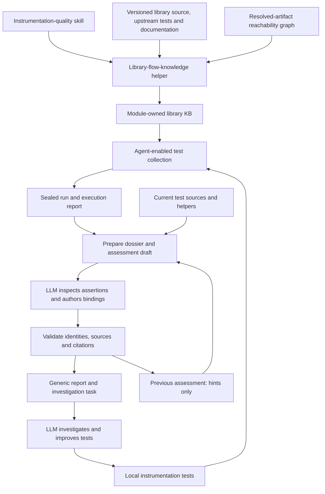

# Pharos — instrumentation quality architecture

Architecture snapshot: **2026-10-01**. This describes the implemented Java prototype and its current
boundaries. Cross-language adapters, portal integration and profiling are directions, not shipped
parts of this architecture. For commands, see [WORKFLOW.md](WORKFLOW.md); for report usage, see
[PHAROS.md](PHAROS.md).

## Purpose and operating model

Pharos reuses instrumentation tests to discover what library behavior is exercised, what assertions
support it, and where further investigation or stronger tests would help. Passing tests, observed
execution, Context state and verified behavioral expectations are separate evidence dimensions.

The LLM follows the `instrumentation-quality` skill through:

**Discover → build/update KB → collect → assess assertions → improve tests → recollect → reassess.**

The LLM authors semantic knowledge and test changes. Deterministic tools resolve artifacts, analyze
bytecode, collect observations, validate evidence and render reports. The skill orchestrates an
interactive agent session; there is no background agent service or external LLM call in the scripts.
No acceptance-policy engine or universal instrumentation-quality threshold is implemented.

Arrows describe artifact handoffs, not recorded runtime call edges. The report UI is optional to the
LLM loop: agents can inspect JSON directly.

## Skills and deterministic components

| Component | Responsibility |
| --- | --- |
| [instrumentation-quality](../../.agents/skills/instrumentation-quality/SKILL.md) | Entry point; select the current phase, carry evidence forward, investigate and iterate within the requested scope |
| [library-flow-knowledge](../../.agents/skills/library-flow-knowledge/SKILL.md) | Author reusable behavior knowledge from upstream tests, documentation, implementation and graph evidence |
| `workflow.py` | Initialize module configuration, generate graphs, validate bindings, collect, seal and replay runs |
| `graph-query.py`, `validate-knowledge.py` | Bounded graph exploration and structural knowledge validation |
| `collection.init.gradle` and Java observer/adapters | Opt-in Gradle integration and per-test method-entry observations with the tracer running |
| `scripts/join.py` | Deterministically join a saved KB/graph with the selected run's observations |
| `pharos.py` | Shared report interface: prepare, assess, resume, render, validate, replay and compare; compatibility build for the upstream pilot |
| `assessment.py` | Prepare run-specific dossiers and validate LLM-authored assertion bindings |
| `portal/index.html` | Generic compact viewer; loads report JSON or is rendered with embedded data |
| `cartography/` | Optional Spring upstream-runtime recording, classification and richer source-assessment experiment |

The skill was renamed from `instrumentation-coverage` to `instrumentation-quality`; the existing
`tools/instrumentation-coverage/` directory and collection command names are retained.

## Artifact ownership and lifetime

**Library knowledge is reusable; assertion assessments are run-specific.** A change to a local test
normally requires new collection and reassessment, not regeneration of unchanged library knowledge.

| Artifact | Location / lifetime | Contents |
| --- | --- | --- |
| Library configuration | Module `coverage/library.json` | Coordinates, reviewed version, artifact groups or JDK module, runtime configuration and test tasks |
| Observation configuration | Module `coverage/observation.json` | Adapter, selected classes, required production transformations and attribution mode |
| Library KB | Module `coverage/{catalog.json,flows.json,evidence.json,knowledge-review.md}` | Functionality scope, stable flows, references, method checkpoints, optional Context contracts and review rationale |
| Graph | Generated/cache directories; tied to resolved artifacts | Bytecode inventory, declared calls, dynamic invocation metadata and derived views |
| Collection run | Module `build/instrumentation-coverage/RUN_ID/` | Copied knowledge, resolved artifacts, graph, observations, test results, seal and execution reports |
| Dossier | Iteration `dossier.json` | Current test-source text, candidate test identities, observations, previous bindings and source-change information |
| Assertion assessment | Iteration `assessment.json` | Source hashes, input report identity, per-behavior assertion bindings, citations and rationale |
| Session | Iteration `session.json` | Module/report paths, phase, previous assessment and next command/action |
| Assessed report | Iteration `report/{report.json,index.html}` | Selected-run observations plus validated assertion-association data |

Source-authored module knowledge belongs in version control. Generated runs and iteration artifacts
remain under build/output directories. A session record resumes the assessment/investigation handoff;
it is not a general scheduler or a transaction log of every graph/build operation.

## Collection orchestration

`workflow.py` is a standard-library CLI orchestrator. It creates a unique run directory, snapshots
module knowledge, invokes Gradle, checks identities and collection health, and invokes the join.
`collection.init.gradle` is the opt-in Gradle bridge. A future convention plugin can call the same
components; this first implementation avoids installing behavior globally into every module.

The same tool root supplies the Java bytecode analyzer, observer, Spock/Jupiter adapters, Python
deterministic join, schemas, and shared viewer. The viewer is independent of any instrumentation module.
No LLM runs during collection, graph binding, joining or rendering.

## Graph identity

The bridge exports coordinates, paths and SHA-256 hashes from the selected test runtime. The graph
cache includes the artifact list, analyzer source, standalone build and dependency catalog hashes.
Paths are included for local cache correctness because raw artifacts retain paths; cross-machine
cache portability is not claimed. The raw graph retains declared bytecode calls, invokedynamic
sites/bootstrap metadata, and candidate lambda implementation edges. Derived simplified views do
not replace the raw graph.

Core JDK integrations use the selected test launcher's versioned `jmods/<module>.jmod` as the graph
input. Its runtime version and SHA-256 are recorded like resolved library artifacts, so JDK behavior
is never silently compared across toolchains.

Graph bindings resolve the reviewed catalog against this graph. A separate versioned functionality
inventory classifies reviewed API families as mapped, candidate, or excluded. Validation binds its
representative entry methods and checks its flow references, but never promotes a candidate into a
required flow. Joined reports render candidates beside mapped flows and count tests that hit their
representative entries; this is entry evidence until a reviewed corridor exists. Callback,
reflection and virtual dispatch gaps remain explicit; a graph path is not runtime call evidence.

## Collection

The Spock adapter observes existing instrumentation specifications with the production transformer
installed. The observer reads the bootstrap Context implementation and does not activate Context.
It installs after `setupSpec`, so load-time library and instrumentation decisions retain the test's
configured semantics. Production entry advice still surrounds the observed method body because the
observer adds its retransformation after the production transformer. Feature-body collection
excludes setup and cleanup.

Each report records its run ID, worker ID, specification, tracer checks and health. Worker-specific
folders prevent different worker processes from overwriting the same specification report. Tests
are serialized in this mode. The initiating thread's test label is exact; worker labels refer to
the active test window and do not establish request lineage.

Production transformed-class inventories are recorded per specification and required types are
validated against their union after the complete test task. A helper specification may never load
the library type exercised by another specification; requiring every type in every specification
would turn valid heterogeneous module suites into collection failures.

Bootstrap JDK targets cannot call the application-loader collector directly. The workflow appends a
small bridge-only jar to bootstrap, adds the required named-module read edge, and inlines a call to
that bridge at eligible method entries. The bridge prevents recursive notification and delegates to
the existing collector, which reads native Context state and applies the same scenario attribution.
It does not propagate, attach, retain, or synthesize Context.

The JUnit Jupiter adapter intercepts the inherited `AbstractInstrumentationTest.initAll` before
production installation, collects only during ordinary/template/dynamic test invocations, and
finishes before the inherited `tearDownAll` removes the production transformer. It checks tracer
registration, the harness transformer/listener, required transformed classes and bootstrap Context.
An after-all fallback handles setup failures. Adapter-owned scenario IDs are separate from display
names, preserving parameterized cases with identical labels. Observations record attribution
provenance and confidence independently of native Context state. Autodetection and serialized Jupiter execution
are enabled only by the opt-in Gradle bridge; ordinary unit classes are excluded.

## Run isolation and deterministic join

Each invocation creates a fresh UUID directory. Configuration is copied before execution. The
artifact-export task refuses a changed dependency resolution between graph generation and tests.
The workflow accepts only finalized, error-free observation reports with the current run ID.

After successful collection, the manifest hashes knowledge, graph, observations, test results and
resolved-artifact metadata. Replay verifies both the file inventory and every hash. It reads only
that run, preventing accidental joins with old outputs or additional unrelated reports. These are
consistency checks, not signatures or a security trust boundary.

For identical saved inputs, the join deterministically evaluates the declared flow predicates,
projects per-test observations onto expected methods, and emits the report/task artifacts. Reports
from separate test executions can legitimately differ in counts and timestamps. The source tree's
renderer/generator remains required for replay; byte-for-byte replay across tool revisions is not
promised.

## Evidence states

- Context-present: at least one non-root entry and no root entries in the selected evidence.
- Root: root entries only. This can be intentional.
- Mixed: both root and non-root entries.
- Not observed: in the exact eligible inventory, but no entry in the selected evidence.
- Unknown: outside the inventory or unresolved.

A flow with no matching test has no test window satisfying its predicate. It is not proof that no
part of that behavior exists in the repository. The graph does not prove Context propagation,
correct request identity, runtime call order or cross-thread handoffs.

## Assertion assessment and iteration

`pharos.py prepare` accepts an ordinary joined report or a Pharos report, plus explicitly selected
local test and helper sources. It emits a dossier, an incomplete assessment and a session. Inputs
are identified by library/version, a normalized report digest and source hashes. Preparation refuses
to overwrite a nonempty iteration directory.

The LLM inspects test inputs, assertions, fixtures and helpers, then authors bindings to exact test
identities available for that behavior. Every binding carries a rationale, a supported/partially
supported status and exact local source citations. Unresolved behaviors retain empty bindings and
an explanation. The full declared behavior inventory must remain present.

`pharos.py assess --session ...` checks the pinned input report, source hashes, test IDs, citation
quotes/ranges and assessment structure, then renders the assessed report. The generic format is
`pharos-assertion-assessment`, version 1. `ready: true` means the author has completed the draft for
validation; it is not a quality gate or human approval. Output stays
`LLM_DRAFT_NOT_HUMAN_REVIEWED`. Validation checks consistency, not whether the quoted assertion truly
establishes the claimed behavior.

After a test change, collect a fresh run and prepare a new iteration with `--previous`. Previous
source paths are reused and changed/new sources identified; old bindings are retained only as hints.
Fresh bindings start empty even when source hashes and test identities are unchanged. The LLM
reassesses and rebinds them. Updating old hashes alone is not the workflow.

`pharos.py resume` prints the session's exact paths and handoff. It does not launch an LLM or execute
its next action. Test implementation is performed by the active agent following the skill. A
production instrumentation change needs scope from the user's request; otherwise a demonstrated
failure is retained as a reproducer and reported.

## Report and task interfaces

The compact viewer uses `format: pharos-report`, `schemaVersion: 1`. Its domain checks are in
`pharos.py`; the older joined report/task schemas remain in `schemas/`. These are distinct formats,
not interchangeable schema-version numbers. The viewer does not perform full JSON Schema validation.

Library identity, behavior names, stage groups, references, tests and method observations come from
data. The same viewer loads report JSON through a file picker or runs offline as a snapshot with
embedded data and the Pharos lighthouse. No Spring-specific stage definitions live in the viewer;
the optional Spring producer supplies its curated groups.

Reports distinguish execution evidence from source-cited behavioral support. The headline counts
BEHAVIOR_SUPPORTED behaviors / declared mapped behaviors as a percentage, independent of catalog
review status. Candidate families are excluded from that denominator. Inventory signals and review
bookkeeping stay in authoring artifacts, not an omissions panel. See
[CATALOG_RECONCILIATION.md](CATALOG_RECONCILIATION.md) for the persisted input/review contract. Method
execution remains drilldown evidence, not an overall scenario coverage score.

Rows and corridors default to aggregate observations across associated and candidate tests. Green
means Context was seen at least once; gray means root-only; hatching means no hit. Methods outside
collection remain unknown. Root observations remain inspectable even when aggregate coverage is green.
Selecting a test switches to its observations only, including mixed states. Corridors group reference
methods; they do not claim a recorded order, mandatory path, one complete test path or async causality.
Downloads identify aggregate versus selected-test scope and contributing test IDs.

Compact-view downloads are `INVESTIGATE_TEST_EVIDENCE` tasks. They include library/version, report
identity, selected test/reference, method observations, source assertions, KB evidence when present,
run metadata, available rerun commands and limitations. A selected stage adds focus without dropping
the other evidence. Possible outcomes include sufficient existing tests, stronger assertions, a new
scenario, a mapping/collection correction, or an inconclusive result. A root observation or missing
reference method does not establish an instrumentation defect.

The older full viewer retains flow-specific action bundles such as `ADD_FLOW_TEST`,
`EXPAND_ENTRY_INVENTORY`, `INVESTIGATE_REACHABILITY` and `INVESTIGATE_CONTEXT_GAP`. Both interfaces are
investigation aids; neither automatically applies a production fix.

Report comparison is a deterministic inspection tool, not an acceptance policy. The Pharos comparison
checks library/version, evidence basis, behavior IDs, reference method sets and method eligibility
before listing changes in assessed tests, candidates and observed methods.

## Optional upstream-runtime enrichment

The Spring cartography experiment runs selected version-matched upstream tests in a standalone
harness, records method sets and partial synchronous nesting, and uses repeated recordings to form
reference fingerprints. Similarity retrieves candidate local tests; it does not prove the scenario
or its assertions. Async handoff edges are not recorded or inferred from shared Context.

This experimental source-assessment path has its own pinned assessment format and remains available
through `pharos.py build`. Its output can enter the generic prepare/assess loop. The recording setup
is still Spring-specific; other modules do not need it to author a KB or assess local assertions.

## Current boundaries and extension points

- The implementation is Java-specific, with Spock and JUnit adapters. Other tracers would need native
  collectors and test adapters; a cross-language implementation has not been delivered.
- Initiating-thread attribution and temporal worker attribution do not establish the same thing.
  Late async work can fall into another test window. There is no causal async graph.
- Current-source dossiers are snapshots at preparation time, not immutable snapshots of the original
  run's complete test-source closure. Old-run assessments require a matching checkout or an explicit
  limitation; the collection seal does not cover all inherited source code.
- Static analysis cannot resolve every reflective, virtual or dynamic callback path. Observation is
  limited to the selected, loadable entry inventory. Missing optional dependencies can restrict it.
- The functionality catalog is bounded and authored. Tests and documentation improve its evidence;
  neither graph generation nor validation certifies completeness or semantic truth.
- The generic handoff retains evidence already available for each declared behavior. It cannot invent
  an absent test identity or an unrecorded method observation; correct mapping/collection and rerun.
- There is no automatic semantic reassessment, universal quality gate, autonomous background service,
  toolkit/portal integration, or automatic instrumentation fix. Profiling is excluded from the current
  quality view; CPU/allocation attribution is a possible later input.
- Customer examples can enrich the KB with explicit provenance in future. Such examples should remain
  evidence for particular scenarios, not automatically become universal requirements.

## Validation so far

The collection workflow has been exercised on Spring MVC and RxJava with the tracer enabled. The
Spring missing-body experiment demonstrated a report → investigation task → test improvement → fresh
collection → source-assessment loop; see [its record](cartography/pilot/experiments/missing-body/README.md).

The generic preparation/reassessment handoff was then exercised using saved Spring baseline and
candidate runs and one inspected RxJava behavior, without new integration-test executions for that
handoff change. Regression checks cover stale inputs, invalid citations, altered behavior inventories
and non-transfer of old assertion support. Skill validation and browser checks cover the entry points,
shared viewer and downloaded evidence. This establishes the tested prototype paths, not every
library, language or autonomous KB-authoring scenario.
